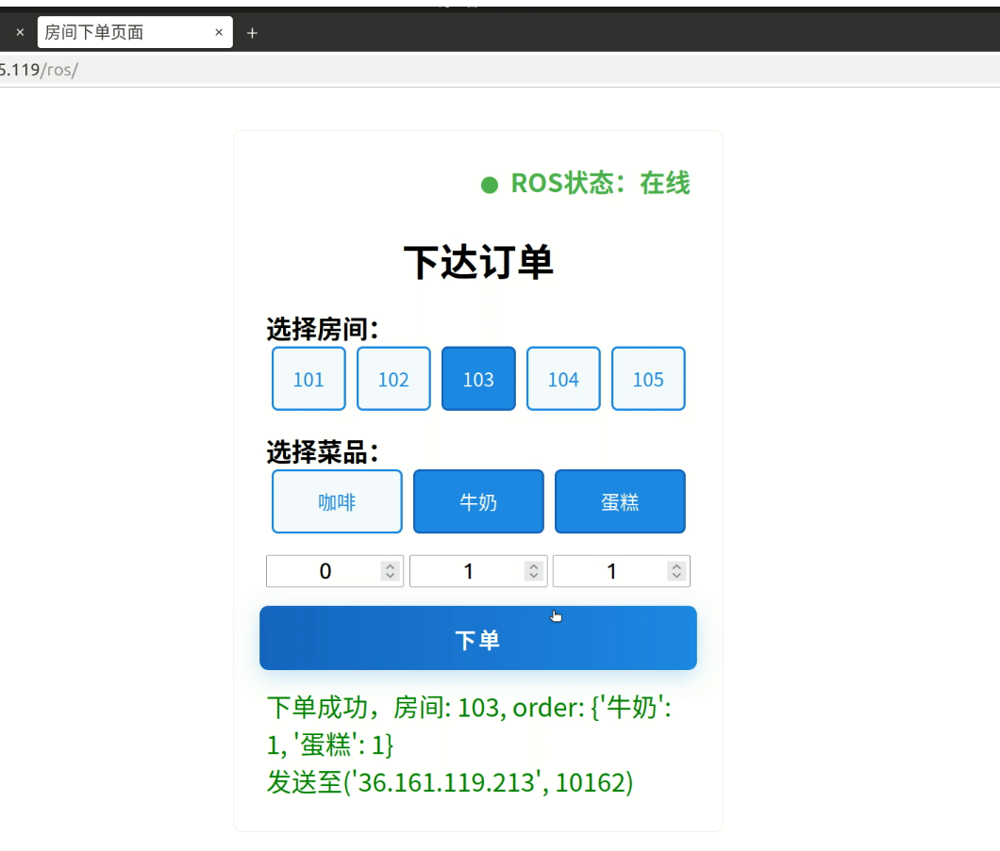

# Ros_Design

A course project for robotics: **酒店智能送餐机器人**  
*A smart delivery robot for hotel food service.*

---

## 项目任务

> **任务描述**  
> 25、酒店智能送餐机器人  
> - 个人语音下单，机器人根据语音指令取餐  
> - 导航到指定送餐位置  
> - 根据门牌号识别，实现餐品确认送达  
>
> **要求：**  
> - 环境需有 3~5 个房间模拟酒店  
> - 送餐类型至少 3 种  
> - 最终根据门牌号确定送餐房间

---

## 项目展示

### 仿真环境

<p align="center">
    
</p>

### RViz 概览

<p align="center">
    
</p>

### Web 下单页面

<p align="center">
    
</p>

---

## 环境配置

```bash
# 建议将解释器设为自己的 conda 环境
pip install -r requirements.txt
```

### 修改机器人模型配置

```bash
roscd turtlebot3_description
```
编辑 `urdf/turtlebot3_waffle.urdf.xacro` 第 195 行内容为：

```xml
<origin xyz="0.064 -0.065 0.094" rpy="0 -0.7854 0"/>
```

### 添加世界资源文件

```bash
cp -r models/* ~/.gazebo/models
```

### 机器人终端使用前

```bash
export TURTLEBOT3_MODEL=waffle
```

---

## 建图流程

```bash
roslaunch ros_design build_world.launch
roslaunch ros_design build_map.launch
roslaunch teleop_twist_joy teleop.launch    # 手柄遥控
rosrun map_server map_saver -f $(rospack find ros_design)/maps/map
```

---

## 导航

```bash
roslaunch ros_design build_world.launch
roslaunch ros_design turtlebot_navigation.launch
# 下单
python scripts/order_tcp.py
```

---

## 手柄遥控

```bash
sudo apt-get install ros-${ROS_DISTRO}-joy ros-${ROS_DISTRO}-teleop-twist-joy
ls /dev/input/js*    # 插上手柄检测系统已识别
roslaunch teleop_twist_joy teleop.launch    # 手柄遥控
# (需要对 launch 和 config 文件做小修改)
```

---

## 摄像头

```bash
# 话题
/camera/rgb/image_raw

# 处理（可用于遥控查看）
~/miniconda3/bin/python scripts/process_image.py
/usr/bin/python scripts/get_image.py
```

---

## 模型权重

- **Vosk 权重下载**：[vosk](https://alphacephei.com/vosk/models)（放在 `scripts/checkpoints`）
- **TTS 权重下载**：[tts](https://coqui.gateway.scarf.sh/v0.6.1_models/tts_models--zh-CN--baker--tacotron2-DDC-GST.zip)（放在 `~/.local/share/tts`）
- **YOLO 权重下载**：[yolo](https://drive.google.com/file/d/1TsKEgMmDxBiGm7AFvVJ0QGOUlJRjUzog/view?usp=sharing)（放在 `scripts/checkpoints`）

```bash
# 安装 tts 需要
sudo apt-get install espeak
```

---

> 如有问题欢迎提 issue 或联系作者。

